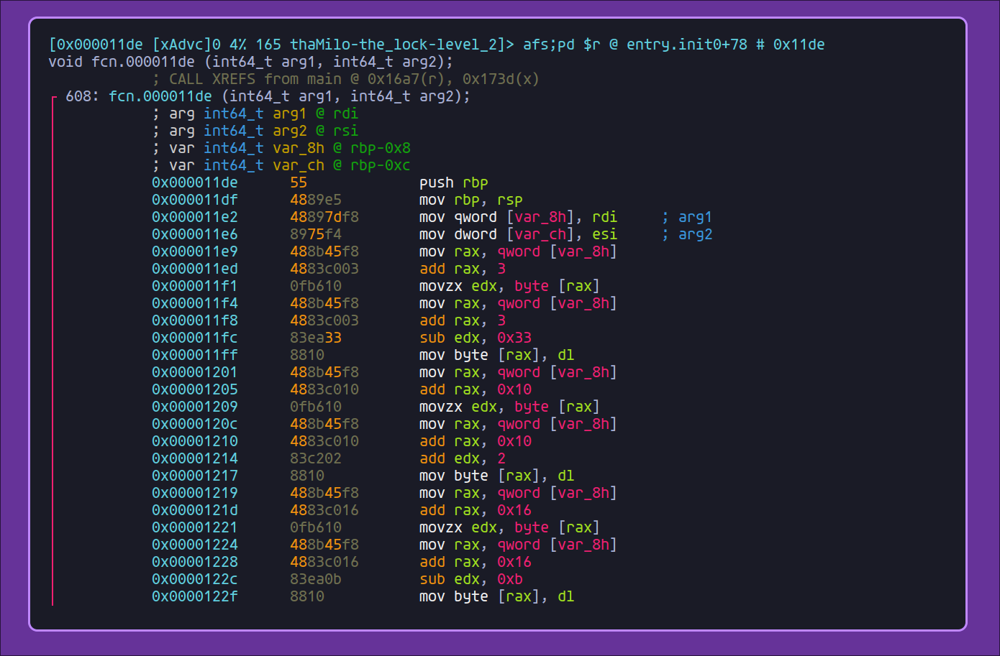
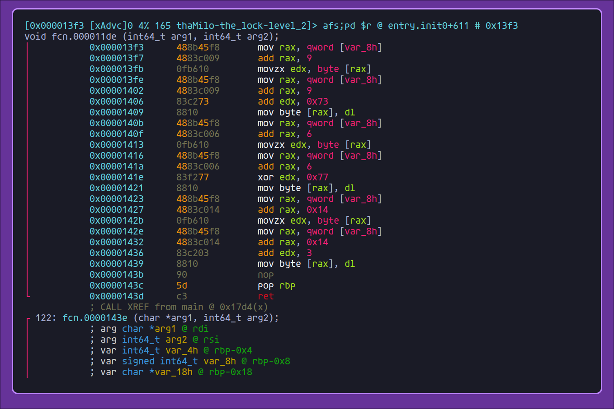

# level-1

For the first level I first wanted to see what was going inside using Ghidra

```c
undefined4 main(void)
{
  char *pcVar1;
  size_t sVar2;
  int iVar3;
  char acStack_115 [257];
  size_t local_14;
  undefined *local_10;
  
  local_10 = &stack0x00000004;
  setvbuf(_stdin,(char *)0x0,2,0);
  setvbuf(_stdout,(char *)0x0,2,0);
  setvbuf(_stderr,(char *)0x0,2,0);
  logo();
  puts(
      "This program hides \x1b[0;32ma secret flag\x1b[0m in a virtual-safe protected by a \x1b[0;33m super-secret-password\x1b[0m (it\'s so good that \x1b[1;37ma lot of people use it!\x1b[0m) and  does the following:"
      );
  printf("\x1b[0;36m1)\x1b[0m decodes the password in memory (function at address: \x1b[0;35m%p\x1b[ 0m)\n"
         ,decode);
  printf("\x1b[0;36m2)\x1b[0m checks whether you know the password; if you do, the flag is printed ( using function at address: \x1b[0;35m%p)\n"
         ,print_flag);
  printf("\x1b[0;36m3)\x1b[0m overwrites the password in memory with zeroes (function at address: \x 1b[0;35m%p\x1b[0m)\n"
         ,clear);
  puts("\x1b[0;36m4)\x1b[0m exits");
  printf("The \x1b[0;33maddress of super-secret-password is random\x1b[0m (this time it is \x1b[0;35 m%p\x1b[0m), but it will be passed, as the first argument, to some functions. If you could only st op time and read the password before it\'s too late...\n\n"
         ,my_super_password);
  decode(my_super_password,0xc);
  printf("Please \x1b[0;31menter the password\x1b[0m: ");
  pcVar1 = fgets(acStack_115 + 1,0x100,_stdin);
  if (pcVar1 == (char *)0x0) {
    exit(1);
  }
  sVar2 = strlen(acStack_115 + 1);
  local_14 = sVar2;
  if (acStack_115[sVar2] == '\n') {
    local_14 = sVar2 - 1;
    acStack_115[sVar2] = '\0';
  }
  iVar3 = strcmp(acStack_115 + 1,my_super_password);
  if (iVar3 == 0) {
    printf("\x1b[0;33m\nWow! You got it, congratulations.\n\x1b[0m");
    print_flag(acStack_115 + 1,local_14);
  }
  else {
    puts("\nNice try... however, it\'s wrong. Try again.");
  }
  clear(my_super_password,0xd);
  return 0;
}
```

I noticed immediately that right after printing out infos about the program it called the **decode** function on my_super_password before prompting the user to insert it.
As hinted by the program

```
"...If you could only stop time and read the password before it's too late..."
```

Dumping the value of **my_super_password**'s address with gdb right after it was decoded was just enough to get the password

```
(gdb) x/s 0x5656f50c
0x5656f50c <my_super_password>:	"residentevil"
```

And using that granted me the flag

```
BASC{Y0u_int3rc3pt3d_stRcMp_didnt_U---thaMilo-8NUmLrFh}
```

# level-2

```
(gdb) b __libc_start_main
Function "__libc_start_main" not defined.
Make breakpoint pending on future shared library load? (y or [n]) y
Breakpoint 1 (__libc_start_main) pending.
```

```
(gdb) r
Starting program: ~/.../thaMilo-the_lock-level_2
[Thread debugging using libthread_db enabled]
Using host libthread_db library "/usr/lib/libthread_db.so.1".
Breakpoint 1, __libc_start_main_impl (main=0x555555555620, argc=1, argv=0x7fffffffddc8,
    init=0x0, fini=0x0, rtld_fini=0x7ffff7fcb200 <_dl_fini>, stack_end=0x7fffffffddb8)
    at ../csu/libc-start.c:242
242	{
```

**0x0x555555555620**


```
(gdb) b *0x555555555620
Breakpoint 2 at 0x555555555620
```

```
Breakpoint 2, 0x0000555555555620 in ?? ()
(gdb) ni
0x0000555555555621 in ?? ()
(gdb) ni
0x0000555555555624 in ?? ()
.
.
.
(gdb) ni
1) decodes the password in memory (function at address: 0x5555555551de)
.
.
.
2) checks whether you know the password; if you do, the flag is printed (using function at address: 0x555555555506)
.
.
.
(gdb) ni
The address of super-secret-password is random (this time it is 0x55555556b510), but it will be passed, as the first argument, to some functions. If you could only stop time and read the password before it's too late...
```

```
(gdb) x/s 0x55555556b510
0x55555556b510:	"\245= gW\017@\246:\276(\326x\231\325Cc\232G\306bGzqM"
```

```
(gdb) b *0x5555555551de
Breakpoint 3 at 0x5555555551de
```



```
.
.
.
(gdb) ni
0x000055555555574c in ?? ()
(gdb) x/s 0x55555556b510
0x55555556b510:	"123456789123_lovelovelove"
```

```
BASC{Br3akP0int5_and_3mul4t10n_R_us3fUl---thaMilo-Q8rGk6EE}
```