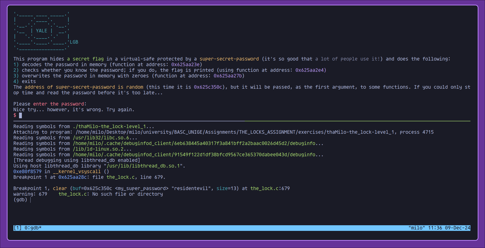

# level-1

For the first level I first wanted to see what was going inside using Ghidra

```c
undefined4 main(void)
{
  char *pcVar1;
  size_t sVar2;
  int iVar3;
  char acStack_115 [257];
  size_t local_14;
  undefined *local_10;
  
  local_10 = &stack0x00000004;
  setvbuf(_stdin,(char *)0x0,2,0);
  setvbuf(_stdout,(char *)0x0,2,0);
  setvbuf(_stderr,(char *)0x0,2,0);
  logo();
  puts(
      "This program hides \x1b[0;32ma secret flag\x1b[0m in a virtual-safe protected by a \x1b[0;33m super-secret-password\x1b[0m (it\'s so good that \x1b[1;37ma lot of people use it!\x1b[0m) and  does the following:"
      );
  printf("\x1b[0;36m1)\x1b[0m decodes the password in memory (function at address: \x1b[0;35m%p\x1b[ 0m)\n"
         ,decode);
  printf("\x1b[0;36m2)\x1b[0m checks whether you know the password; if you do, the flag is printed ( using function at address: \x1b[0;35m%p)\n"
         ,print_flag);
  printf("\x1b[0;36m3)\x1b[0m overwrites the password in memory with zeroes (function at address: \x 1b[0;35m%p\x1b[0m)\n"
         ,clear);
  puts("\x1b[0;36m4)\x1b[0m exits");
  printf("The \x1b[0;33maddress of super-secret-password is random\x1b[0m (this time it is \x1b[0;35 m%p\x1b[0m), but it will be passed, as the first argument, to some functions. If you could only st op time and read the password before it\'s too late...\n\n"
         ,my_super_password);
  decode(my_super_password,0xc);
  printf("Please \x1b[0;31menter the password\x1b[0m: ");
  pcVar1 = fgets(acStack_115 + 1,0x100,_stdin);
  if (pcVar1 == (char *)0x0) {
    exit(1);
  }
  sVar2 = strlen(acStack_115 + 1);
  local_14 = sVar2;
  if (acStack_115[sVar2] == '\n') {
    local_14 = sVar2 - 1;
    acStack_115[sVar2] = '\0';
  }
  iVar3 = strcmp(acStack_115 + 1,my_super_password);
  if (iVar3 == 0) {
    printf("\x1b[0;33m\nWow! You got it, congratulations.\n\x1b[0m");
    print_flag(acStack_115 + 1,local_14);
  }
  else {
    puts("\nNice try... however, it\'s wrong. Try again.");
  }
  clear(my_super_password,0xd);
  return 0;
}
```

I noticed immediately that the program called the **decode** function before prompting the user to insert the password.
So as the bin suggested when the **clear function** was called I could read the decoded password because it was passed as the first argument.
Setting a break-point to that function and giving a random string as password was enough to lock-pick the first level.



Using "residentevil" as password I was able to get the first flag

```
BASC{Y0u_int3rc3pt3d_stRcMp_didnt_U---thaMilo-8NUmLrFh}
```

Automating this with python resulted in the following script

```python
from pwn import *

p = process("./thaMilo-the_lock-level_1")

gdb.attach(
    p,
    """
    break clear
    continue
""",
)

password = b"a"
p.sendline(password)
p.interactive()
```

# level-2

## Manual approach using gdb

Running "file" revealed that the bin was stripped so I couldn't rely on functions' name to step through it.
Assuming that the first call made by the program was to \_\_libc_start_main I set a break-point to it with gdb and ran to reveal the real main address

```
(gdb) b __libc_start_main
Function "__libc_start_main" not defined.
Make breakpoint pending on future shared library load? (y or [n]) y
Breakpoint 1 (__libc_start_main) pending.
(gdb) r
Starting program: ~/.../thaMilo-the_lock-level_2F
[Thread debugging using libthread_db enabled]
Using host libthread_db library "/usr/lib/libthread_db.so.1".
Breakpoint 1, __libc_start_main_impl (main=0x555555555620, argc=1, argv=0x7fffffffddc8,
    init=0x0, fini=0x0, rtld_fini=0x7ffff7fcb200 <_dl_fini>, stack_end=0x7fffffffddb8)
    at ../csu/libc-start.c:242
242	{
```

After that I set a break-point at that address and stepping one instruction at a time I was able to get the other addresses revealed by the executable itself

```
(gdb) b *0x555555555620
Breakpoint 2 at 0x555555555620
(gdb) c
Continuing.
Breakpoint 2, 0x0000555555555620 in ?? ()
(gdb) ni
0x0000555555555621 in ?? ()
(gdb) ni
0x0000555555555624 in ?? ()
.
.
.
(gdb) ni
3) overwrites the password in memory with zeroes (function at address: 0x5555555554b8)
0x0000555555555701 in ?? ()
.
.
.
(gdb) ni
The address of super-secret-password is random (this time it is 0x55555556b510), but it will be passed, as the first argument, to some functions. If you could only stop time and read the password before it's too late...
```

Doing so I got the "reset password" function address and, as above, I set a break-point to it dumping the value of the decoded "super password"'s address after being prompted.

```
(gdb) b *0x5555555554b8
Breakpoint 3 at 0x5555555554b8
(gdb) c
Continuing.
Please enter the password: a
Nice try... however, it's wrong. Try again.
(gdb) x/s 0x55555556b510
0x55555556b510:	"123456789123_lovelovelove"
```

Using "123456789123_lovelovelove" as password I was able to get the flag

```
Wow! You got it, congratulations.
Here is your flag:
BASC{Br3akP0int5_and_3mul4t10n_R_us3fUl---thaMilo-Q8rGk6EE}
```

## Automated approach using unicorn

```python
from unicorn import *
from unicorn.x86_const import *
from pwn import *

CODE = 0x10000000
CODE_SIZE = 0x30000000
STACK = 0x60000000
STACK_SIZE = 0x10000000


def hook_code(mu, address, size, user_data):
    if address == CODE + 0x11DE:
        mu.reg_write(UC_X86_REG_RDI, CODE + 0x16510)
    if address == 0x100010CF:
        mu.reg_write(UC_X86_REG_RIP, CODE + 0x1620)
    if address == 0x10001632:
        mu.reg_write(UC_X86_REG_RIP, CODE + 0x1733)

def init_mu():
    with open("./thaMilo-the_lock-level_2", "rb") as f:
        code = f.read()
        mu = Uc(UC_ARCH_X86, UC_MODE_64)
        mu.mem_map(STACK, STACK_SIZE, UC_PROT_READ | UC_PROT_WRITE | UC_PROT_EXEC)
        mu.reg_write(UC_X86_REG_RSP, STACK + (STACK_SIZE // 2))
        mu.mem_map(CODE, CODE_SIZE, UC_PROT_READ | UC_PROT_WRITE | UC_PROT_EXEC)
        mu.mem_write(CODE, code)
        mu.hook_add(UC_HOOK_CODE, hook_code)
        return mu


if __name__ == "__main__":
    mu = init_mu()
    mu.emu_start(CODE + 0x10B0, CODE + 0x1751)
    print("DECODED PASSWORD : " + mu.mem_read(CODE + 0x16510, 25).decode("latin1"))
```

```
DECODED PASSWORD : 123456789123_lovelovelove
```

```
Wow! You got it, congratulations.
Here is your flag:
BASC{Br3akP0int5_and_3mul4t10n_R_us3fUl---thaMilo-Q8rGk6EE}
```


