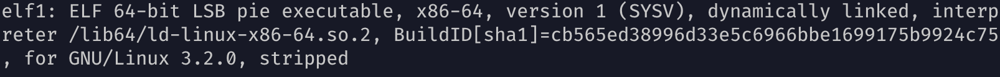

# ELF 1

I started my analysis by running the **file** commmand:

Nothing relevant seemed to be there so I continued by opening the file with the **hte** editor and took a look at the ELF header but nothing relevant was there.
But looking ad the section headers I found this :

![[section_headers_flag.png]]

And there it was!
Flag : **BASC{ s3cTi0N5 }**

# ELF 2

As I did for the first one I ran the **file** command :

![[file_elf2.png]]

So the ELF class was a 32bit executable but the target machine specified was an ARM architecture.
So I tried running the elf file emulating an arm processor with **qemu** and there it was!

Flag : **BASC{ARMed_&_d4ng3r0uS}**

# ELF 3

Using the same procedure as before I ran the **file** command :

![[file_elf3.png]]

The file's name said it's an elf but **file** said otherwise.
So l checked with the **hte** editor

![[hex_elf3.png]]

And looking at the hexdump I saw that the **magic bytes** were not set correctly so I fixed that

![[hex_elf3_fixed.png]]

And then I ran **file** again

![[file_elf3_2nd.png]]

And everything seemed to be fine so I ran the file and there it was!

Flag : **BASC{cAs3_maTT3rS}**

# ELF 4

Using once again the same approach I run the **file** command:

![[file_elf4.png]]

Nothing interesting came up so I ran the file but got 
a **Segmentation Fault Error**.
By definition that *occurs when a program tries to access a memory location that it is not allowed to access*.

As it was a runtime error I had to look at something that mattered when the program was executed like **program headers** that are defined as "*headers that describe how the binary executable file should be loaded into memory by the operating system when it's executed.*"

I did so by using once again the **readelf** command with the **-lW** flags :

![[readelf_lW_elf4.png]]

Something that popped up immediately was that none of the program headers was executable.
As written above the entry point was located at  the address **0x401c60**, inside the second segment.
So i tried to change the second segment with the **hte** editor and made it 
executable :

![[hte_make_executable_elf4.png]]

And by doing so and running the program there it was!

Flag : **BASC{no_eXec_no_party}**

# ELF_files.zip

I looked also at this file and ran, as done before, the **file** command :

![[file_ELF_fileszip.png]]

And it looked like it was an elf file too, so I tried to run the file but  the 
"**./ELF_files.zip: Permission denied**" message came up.
So I looked at the permission bits: 

![[Elfzip_permissions.png]]

It didn't have the execute bit so I added it with the **chmod +x** command and ran again.

There it was!

Flag : **BASC{can_U_run_a_ZIP?}**