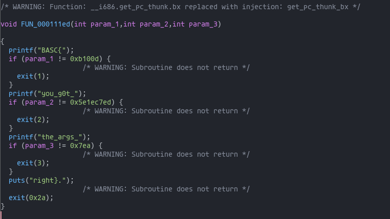
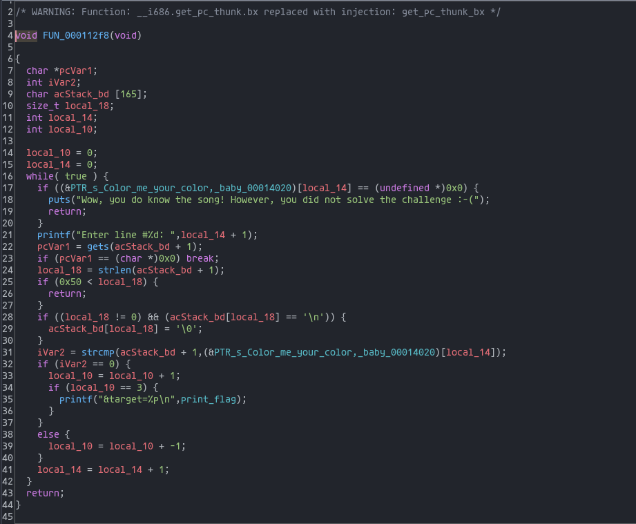

# call_me

```bash
> file call_me_thaMilo
 
call_me_thaMilo: ELF 32-bit LSB pie executable, Intel 80386, version 1 (SYSV), dynamically linked, interpreter /lib/ld-linux.so.2, BuildID[sha1]=db2355e65f8ec0cdc5cdcfc5d4df617518c8a9f6, for GNU/Linux 3.2.0, stripped
```

In order to understand what the executable would normally do I tried to run it and when prompted I inserted random values.
Doing so I finally got this message outputted

```
Wow, you do know the song! However, you did not solve the challenge :-(
```

Reading this I thought that maybe some pattern matching was executed against the input looking for a specific song's lyrics. Leveraging this I opened the file with ghidra looking for something related.
Analysing the functions I found one with a "unique" body


This functions seemed to print a flag if some specific parameters where passed to it. To understand better what was going on I used Ghidra functionality to show the functions' calls' tree.
Doing so I discovered that the "flag function" was called by another one


