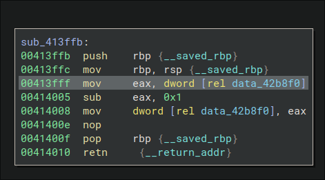

# Toppler32

### Infinite lives mod

The target for this mod was getting toppler to live forever so I started looking for functions that managed his lives.
I came across "pts_died" that had a pretty simple body in pseudo-C:

```C
lifes -= 1
```

So I figured out that replacing that with a "ret" instruction would stop his lifes from getting decreased.

Python code to apply the patch: 

```python
    lifes_left_address = 0x08056417
    patch_code = asm("ret")
    elf.write(lifes_left_address, patch_code)
```


### Infinite time mod

The target for this mod was getting toppler to have infinite time to complete the level so I started looking for functions that managed time inside the game.
I came across "akt_time". 
This function took as argument the current game time and managed different aspects of the game basing on that like toppler's state.
It also managed the level's time decrease itself so I figured that removing the whole function's body would remove the concept of time from the game.

Python code to apply the patch :

```python
    time_update_address = 0x0804C4C9
    patch_code = asm("ret")
    elf.write(time_update_address, patch_code)
```

### No enemies mod

The target for this mod was removing robots from the game. 
So I started looking for functions that managed robot initialization.
I came across "rob_new" that managed the creation of robots inside levels and trivially patching its body with a "ret" instruction got rid of all the enemies

Python code to apply the patch :

```python
	robots_address = 0x08056a4a
	patch_code = asm("ret")
	elf.write(robots_address, patch_code)
```

### No collisions mod

The target for this mod was getting toppler to be unkillable by robots making him untouchable.
So I started looking for functions that managed the way toppler interacted physically with other elements in the game, the so called "collisions".
I came across "top_testcollision".
This function determined toppler's state looking at his vertical position, current state and robots' position as well.
I figured that patching the body with a "ret" instruction would remove every side effect from toppler's interaction with his enemies.

Python code to apply the patch :

```python
    collisions_address = 0x0805CB01
    patch_code = asm("ret")
    elf.write(collisions_address, patch_code)
```

# Toppler64

### Infinite lives mod

The focus for this mod, as did previously on the 32bit version, was giving toppler infinite lives.
Following the hints provided on the Readme I looked for functions accessing the lives value located at address 0x42b8f0 and more specifically where it was being decreased.
I found a function located at address 0x413ffb wher that value was actually decrease by one



Replacing the "sub" instruction with a "nop" actually prevented toppler's lives from getting decreased when he died.

Python code to apply the patch : 

```Python
  lives_address = 0x414008
  patch_code = asm("nop")
  elf.write(lives_address, patch_code)
```

### Infinite time mod

The focus for this mod, as did previously on the 32bit version, was giving toppler infinite time to complete the mission.
From the Readme's hint I knew the location of the "akt_time" function so I did exactly the same thing as before, replacing the function's body with a "ret" instruction and there was the trick!

Python code to apply the patch: 

```Python
  time_address = 0x4063b2
  patch_code = asm("ret")
  elf.write(time_address, patch_code)
```

### No enemies mod

The focus for this mod, as did previously on the 32bit version, was removing completely from the game toppler's enemies.
Looking at the "interesting addresses" and knowing that the two executables were compiled from the same source I noticed that the
function at address 0x414d9e was the same as the one initializing robots in the 32bit version.
So as I did before I placed a "ret" instruction at that address, getting rid of robots initialization.

Python code to apply the patch:

```Python
  robots_address = 0x414d9e
  patch_code = asm("ret")
  elf.write(robots_address, patch_code)  
```

### No collisions mod
